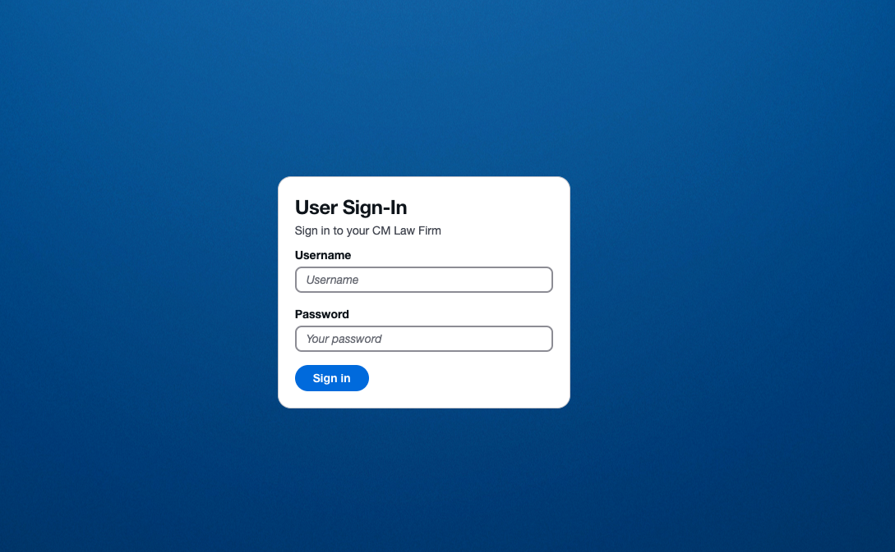
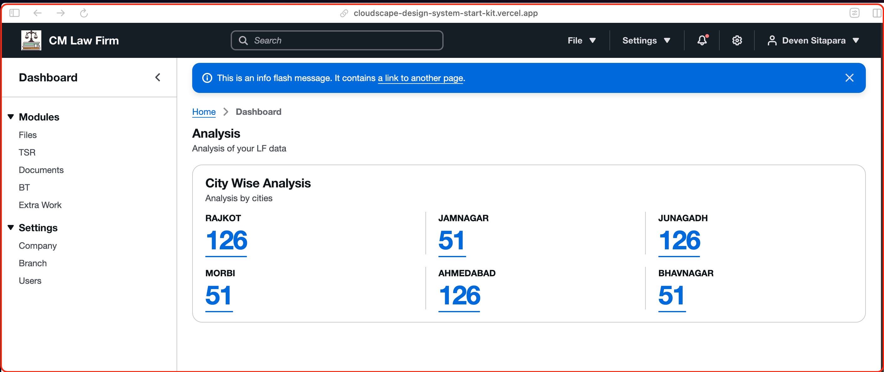
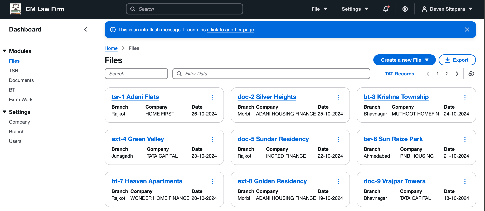

# Cloudscape NextJs Starter Kit

## Getting Started

This is NextJs starter kit for cloudscape design system.

[Demo](https://cloudscape-design-system-start-kit.vercel.app/login/)

# Screensshots

### [Login](https://cloudscape-design-system-start-kit.vercel.app/login/)



### [Dashboard](https://cloudscape-design-system-start-kit.vercel.app/dashboard/)



### [File Module](https://cloudscape-design-system-start-kit.vercel.app/files/)



## Installation

```bash
npm install
```

## Usage

```bash
npm run dev
```

Open [http://localhost:3000](http://localhost:3000) with your browser to see the result.

## Libraries

- Next.js - for server-side rendering
- Cloudscape design system - for UI components
- React - for UI components
- React Query - for state management
- React Hook Form - for form validation
- Zod - for form validation
- Axios - for api calls
- Date-fns - for date formatting
- Zustand - for state management

#### Used following libraries

- `@tanstack/react-query` - for state management
- `zod` - for form validation
- `@auth/nextjs` - for authentication
- `axios` - for api calls
- `date-fns` - for date formatting
- `zustand` - for state management

## Directory and File Structure

- Routes
- Components
- Contexts
- Hooks
- Types
- Utils
- Constants
- Services

## License

[MIT](https://choosealicense.com/licenses/mit/)

## Author

- [Deven sitapara](https://www.github.com/deven-sitapara)

## Learn More

To learn more about Next.js, take a look at the following resources:

- [Next.js Documentation](https://nextjs.org/docs) - learn about Next.js features and API.
- [Cloudscape.design ](https://cloudscape.design/) - learn about Cloudscape design system.
